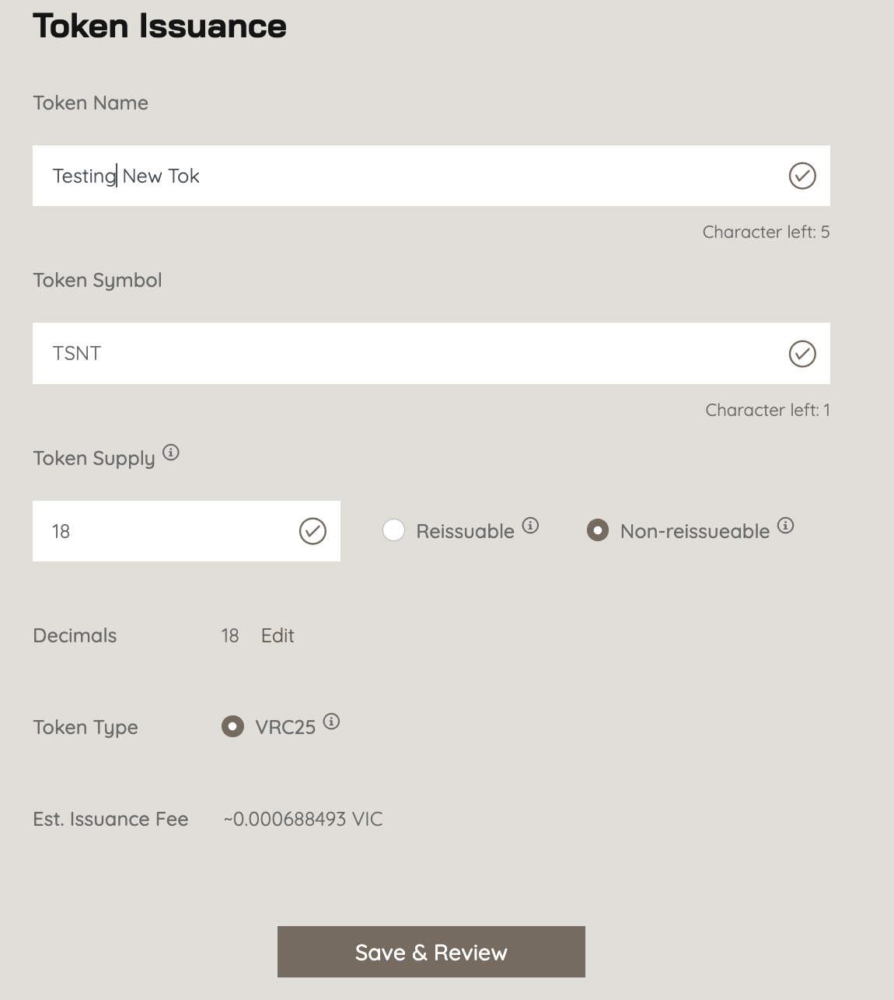
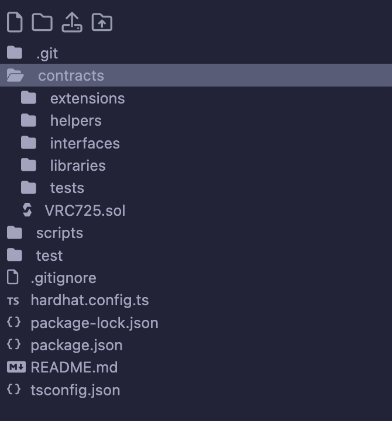
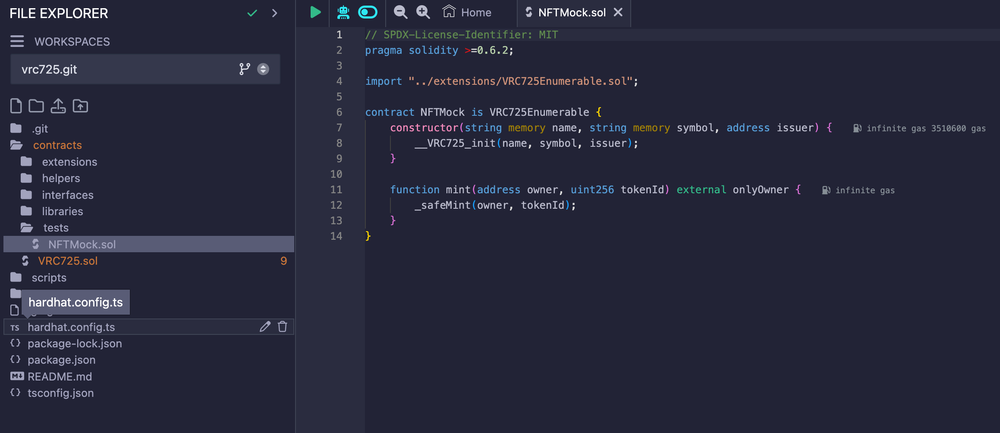
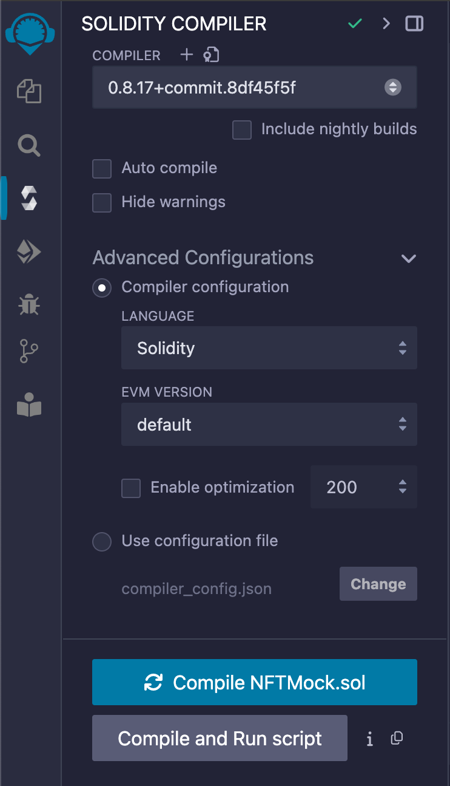
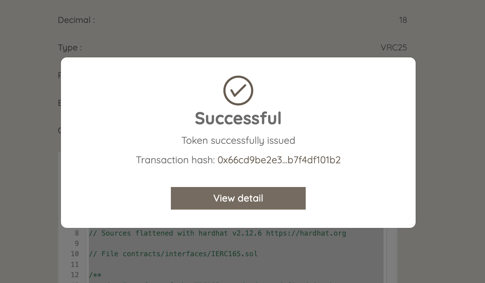
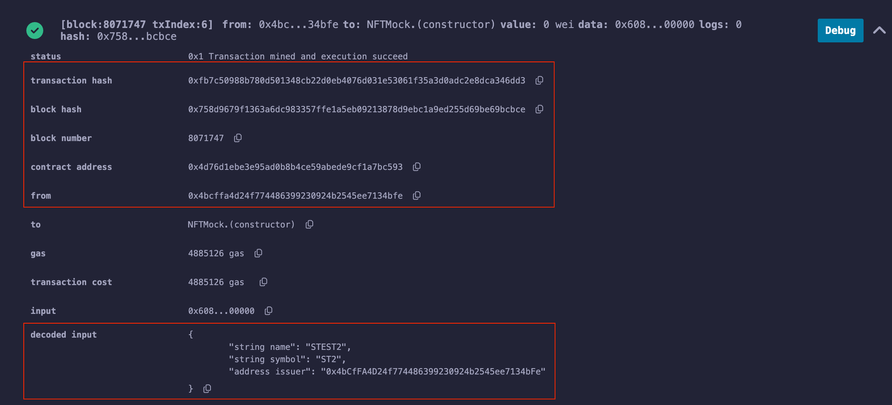
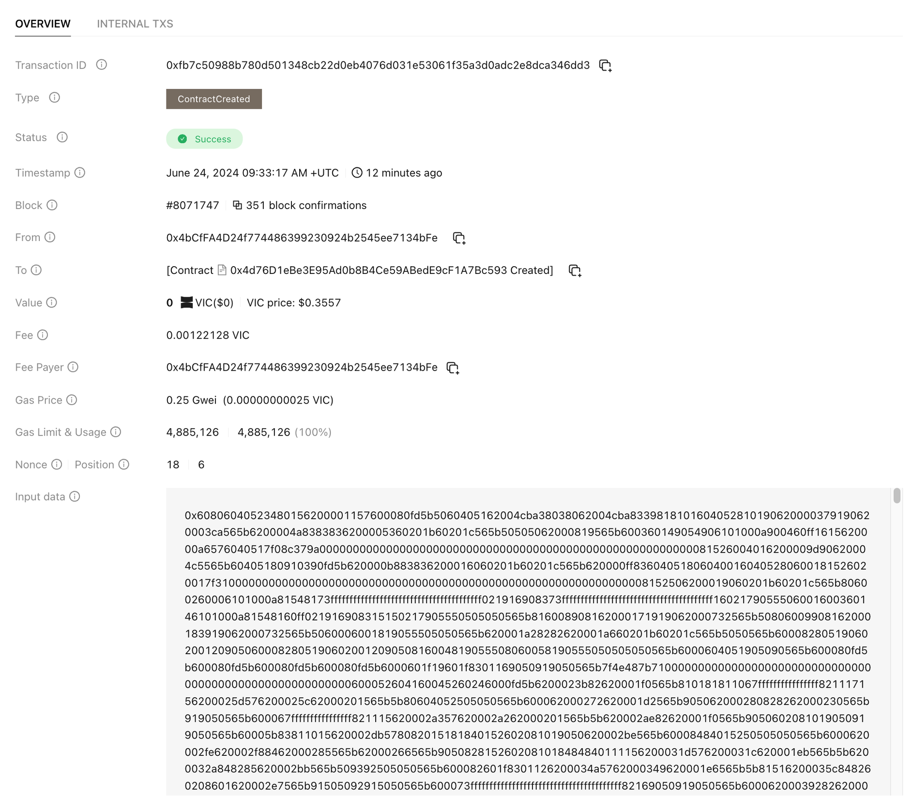

# Copy of How to apply ZeroGas for VRC725 contract

## Deploy a VRC725 contract

Open Remix IDE at: [https://remix.ethereum.org/#lang=en\&optimize=false\&runs=200\&evmVersion=null\&version=soljson-v0.8.26+commit.8a97fa7a.js](https://remix.ethereum.org/#lang=en\&optimize=false\&runs=200\&evmVersion=null\&version=soljson-v0.8.26+commit.8a97fa7a.js)

Cloning the VRC25 from the Repo URL: [https://github.com/BuildOnViction/vrc725.git](https://github.com/BuildOnViction/vrc725.git)

<figure><figcaption></figcaption></figure>

The source code struture will be displayed as image

<figure><figcaption></figcaption></figure>

Under the contracts folder there will be an example for **VRC725 Contract**

<figure><figcaption></figcaption></figure>

Now, we would like to compile the contract as image. Please ensure that the compiler version is **0.8.17+commit.8df45f5f**

<figure><figcaption></figcaption></figure>

Next, we would like to deploy the contract which had been built & compiled above. In this scenario, we are using the **Injected Provider - Coin98 Wallet**. Hence the following pop-up will be displayed.

Since we are using the **C98 Wallet**, hence the **Gas Limit** option can be ticked on **Estimated Gas** per default. However, if you are using the **Metamask**, it is recommended that you would increase it a bit to avoid the failure. The suitable number should be **5000000** wie

<figure><figcaption></figcaption></figure>

After that, we need to fulfill the **Name**, **Symbol** & the **Issuer** (The connected wallet: **0x4bCfFA4D24f774486399230924b2545ee7134bFe**) for the contract. Once all detail is filled up, you can click on the transact button. The pop-up will be displayed to confirm for further process.

<figure><figcaption></figcaption></figure>

If the contract is successfully deployed, the following message will be displayed.

<figure><figcaption></figcaption></figure>

The onchain TX can be found at: [https://testnet.vicscan.xyz/tx/0xfb7c50988b780d501348cb22d0eb4076d031e53061f35a3d0adc2e8dca346dd3](https://testnet.vicscan.xyz/tx/0xfb7c50988b780d501348cb22d0eb4076d031e53061f35a3d0adc2e8dca346dd3)

<figure><figcaption></figcaption></figure>

<figure><figcaption></figcaption></figure>

After we had the VRC725 contract, the next step is to apply the Viction ZeroGas for it.
