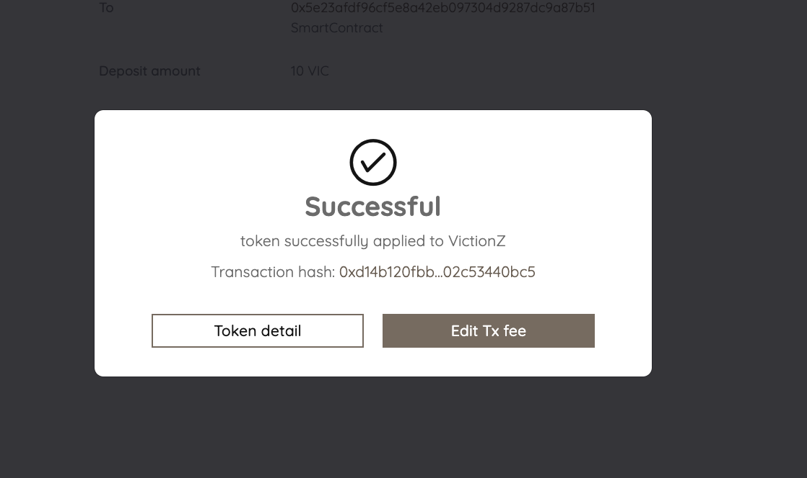

# VicIssuer

Below are the most important features of [VicIssuer](https://issuer.viction.xyz/) that have made it a revolutionary tool:

* **User-Friendly Interface:** Issue a VRC20(deprecated) or VRC25 token in only a few steps.
* **No Coding Experience Required:** No prerequisite knowledge about smart contract programming is needed.
* **Token Customization Options:** Customize the token supply, token name, and minimum transaction fee through VicIssuer’s dashboard.

### **‌Know Your Token Type**

Before issuing your token on Viction, make sure you are aware of the available token types and the differences between them.

**VRC20(deprecated):** VRC20 is an equivalent token standard of ERC20 built on top of the Viction blockchain. VRC20 token holders would need to hold a small amount of VIC to cover extremely low transaction fees.

**VRC25:** VRC25 creates a frictionless experience for non-crypto users by allowing token holders to pay transaction fees by the token itself without having to hold any VIC in their wallet.

**Comparison Table**

|                                                 | **VRC20 (deprecated)** |                                        **VRC25**                                        |
| ----------------------------------------------- | :--------------------: | :-------------------------------------------------------------------------------------: |
| **Technical Requirements for Dapp Integration** |         **Low**        |                                       **Moderate**                                      |
| **Technical Requirements for Exchange Listing** |         **Low**        |                                       **Moderate**                                      |
| **Transaction Fees**                            |     **Native VIC**     | 
<strong>By token itself</strong>

<strong>(no need for native VIC)</strong>
 |

### ISSUE

**Step 1:** Go to [https://issuer.viction.xyz/](https://issuer.viction.xyz/) and click on **Issue New Token**.

<figure><figcaption></figcaption></figure>

**Step 2:** Unlock your wallet by choosing one of the available methods.

<figure><figcaption></figcaption></figure>

**Step 3:** Fill out the token information including Token Name, Token Symbol, Token Supply, Decimals, Token Type VRC20(deprecated) or VRC25, and whether or not it’s reissuable.

* The symbol of the token contract is the symbol by which the token contract should be known, for example “VIC”. It is broadly equivalent to a stock ticker and limited to 5 characters in length.
* Decimals refer to how divisible a token can be, from 0 (not at all divisible) to 18 (pretty much continuous) and even higher if required. Technically speaking, the decimal value is the number of digits that come after the decimal place when displaying token values on-screen.
* Make sure to check out the differences between reissuable/ non-reissuable tokens, and VRC20(deprecated)/ VRC25 tokens by hovering on the information icon and clicking on the **Differences?** hyperlink.

<figure><figcaption></figcaption></figure>

<figure><figcaption></figcaption></figure>


**Disclaimer:** The token issuance fee could vary depending on how much it costs to deploy the smart contract.


**Step 4:** VicIssuer will ask for the token’s information to confirm. Please check all the criteria carefully before clicking on the **Issue token** and wait for the contract to be deployed.

For VRC25 tokens, if you want to verify and publish the contract source code on VicScan, please copy the source code from the **Code review** section. You can refer to the guidance [here](how-to-verify-and-publish-contract-source-code-on-vicscan.md).


If you do not copy it at this stage, you will not be able to go back and copy it later


<figure><figcaption></figcaption></figure>


**Note:** Any developer with some experience developing and deploying smart contracts can refer to our reference implementation of the [Standards & Specification](https://docs.viction.xyz/developer-guide/standards-and-specification) to make customizations to the deployed token contract.


**Step 5:** After successfully issuing the token, you can view the token details on the dashboard of VicIssuer.

<figure><figcaption></figcaption></figure>

## Apply Zero Gas Protocol 

Your token is now ready for use, however **without ZeroGas registration**, you **CAN NOT** enable free gas for your transactions. Please note that you can only apply the ZeroGas Protocol for VRC25 tokens

**Step 1:** On the Token Detail screen, click on the **Apply Zero Gas Protocol.**

<figure><figcaption></figcaption></figure>

**Step 2:** The Zero Gas introduction and conditions will appear; please read them carefully and click the **I Understand** button to proceed.

<figure><figcaption></figcaption></figure>

**Step 3:** The token issuer needs to deposit a minimum amount of 10 VIC. Click the **Submit** button to review.


The deposit can’t be withdrawn. The VIC held in the deposit pool will be deducted to pay the Masternodes for processing transactions.


<figure><figcaption></figcaption></figure>

**Step 4:** On the Zero Gas Protocol Application screen, click on **Apply Zero Gas Protocol** to proceed.

<figure><figcaption></figcaption></figure>

**Step 5: Confirm** the transaction to proceed, a success message will be displayed once the token has been applied.

<figure><figcaption></figcaption></figure>

 

<figure><figcaption></figcaption></figure>

**Step 6:** Click on Token Detail to be redirected to the list page, where you will see the VRC fee fund displayed along with the deposited amount.

<figure><figcaption></figcaption></figure>


Don’t forget to regularly check the balance of the VRC25 deposit because transactions will not be processed if the remaining deposit is not enough to pay the transaction fees.


### **DONATE VIC FOR VRC25 TRANSACTION FEES**

If there are not enough VIC funds to pay for subsequent transaction fees, any token holders can deposit more VIC to the VicIssuer contract to continue making transactions.‌

Go to the **Donate VRC-25 fee** tab from VicIssuer’s homepage. Enter the name of the token to donate VIC to, then enter the donation amount. Considering that the transaction fee in Viction is near zero, 1 VIC can power thousands of transactions.

<figure><figcaption></figcaption></figure>
