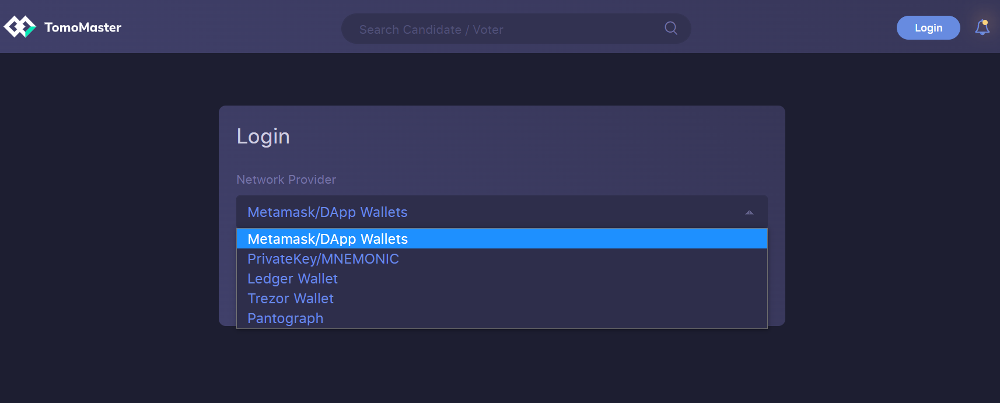

# Staking Requirements

### Prerequisites 

* Have a wallet connected to the VicMaster Governance Dapp

### Introduction 

With a connected wallet, it's time to try voting for some Masternodes. If there is any trouble with connecting to the Viction network, go to [How to Connect to Viction Network](../how-to-connect-to-Viction-network/).

### How To Vote 

Access our Governance Dapp, [VicMaster](https://master.Viction.com/), to start voting for Masternodes.

<figure><figcaption></figcaption></figure>

Click the "Login" button. VicMaster natively supports multiple options to login including MetaMask, [Ledger](https://app.gitbook.com/@Viction/s/Viction-docs/general/how-to-connect-to-Viction-network/ledger), Trezor, and Private Key/Mnemonic. Select the appropriate option and login.

Once configured, vote for Masternodes by clicking on the `Vote` button.

At least 100 VIC is required per vote. After clicking submit, your VIC will be sent to the voting smart contract and locked there.

### How to Unvote 

Unvote by clicking the `Unvote` button on the Masternode's page and enter the amount of VIC to unvote.

After unvoting, VIC is still locked in the smart contract for \~48 hours (96 epochs) before it is able to be withdrawn.

### How to Withdraw 

To withdraw after unvoting, wait until the VIC is unlocked from the smart contract after \~48 hours (96 epochs). Then click the `withdraw` button under the account page (the vertical three dots on the top right) and choose from the list of withdrawal options to withdraw back into the wallet.

Note that you might see multiple withdrawals on the account page if there have been multiple unvotes made previously.

Withdraws cannot be attempted before the unlock period expires.
