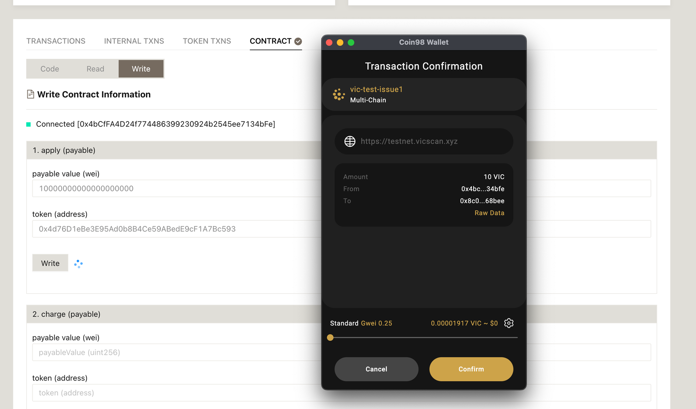
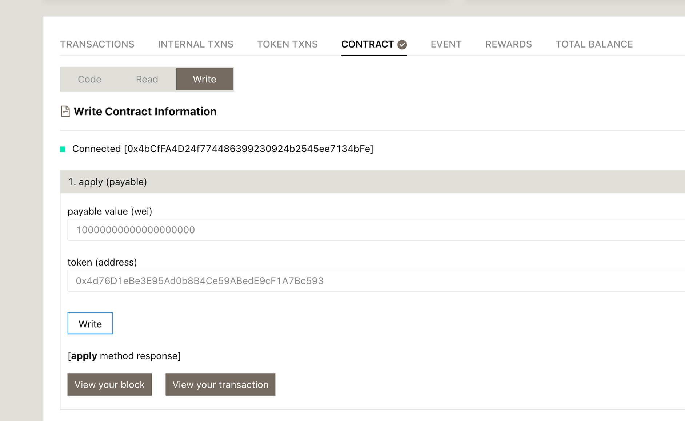
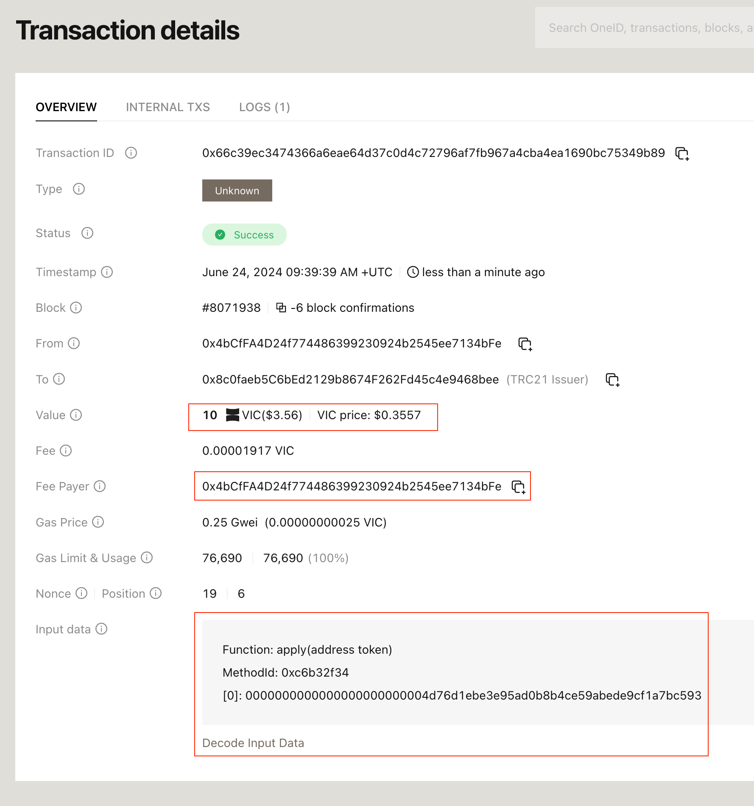

# How to apply ZeroGas for VRC725 contract

## Prerequisites

The VRC725 contract had been deployed (Guide: [https://docs.viction.xyz/how-to/how-to-deploy-the-vrc725-contract](https://docs.viction.xyz/how-to/how-to-deploy-the-vrc725-contract))

## Applying Vic ZeroGas Protocol

This step can be achieved by following step:

* Navigate to the **VRC25Issuer Contract** on **Vicscan**
  * Testnet: [https://testnet.vicscan.xyz/address/0x8c0faeb5C6bEd2129b8674F262Fd45c4e9468bee](https://testnet.vicscan.xyz/address/0x8c0faeb5C6bEd2129b8674F262Fd45c4e9468bee#code)
  * Mainnet:[https://www.vicscan.xyz/address/0x8c0faeb5c6bed2129b8674f262fd45c4e9468bee](https://www.vicscan.xyz/address/0x8c0faeb5c6bed2129b8674f262fd45c4e9468bee)


**Hint**: Please **ensure** that the address to call **apply** function must be current **owner of your token**.


* Access to Contract tab & **connect** the wallet

<figure><figcaption></figcaption></figure>

* Input **10 VIC** for the deposit & the **VRC725 contract address** (**0x4d76D1eBe3E95Ad0b8B4Ce59ABedE9cF1A7Bc593**) to apply the ZeroGas.

<figure><figcaption></figcaption></figure>

<figure><figcaption></figcaption></figure>

<figure><figcaption></figcaption></figure>

Then your **VRC725 contract** is now **ZeroGas** with the following transaction\*\*:\*\* [https://testnet.vicscan.xyz/tx/0x66c39ec3474366a6eae64d37c0d4c72796af7fb967a4cba4ea1690bc75349b89](https://testnet.vicscan.xyz/tx/0x66c39ec3474366a6eae64d37c0d4c72796af7fb967a4cba4ea1690bc75349b89)
