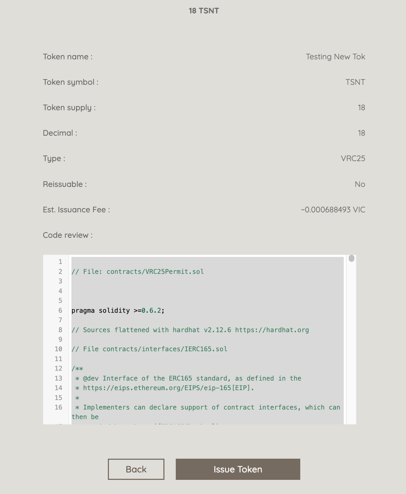

# How to issue a token via VICIssuer

## Issue a token on Vic Issuer 

* VICIssuer on Testnet: [https://issuer-testnet.viction.xyz/](https://issuer-testnet.viction.xyz/)
* VICIssuer on Mainnet:[https://issuer.viction.xyz/](https://issuer.viction.xyz/)

The user is required to declare the Token Name, Symbol & Total Supply in order to issue the new token.

<figure><figcaption></figcaption></figure>

Ensure that all detail is correct then click on the **Issue Token** button. The code here is only displayed in this step. Hence It is recommended that you copy & store it to your file. So you can use it to perform the contract verification later on.


If you didn't copy the source code here, there is no way for you to go back to copy it again.


<figure><figcaption></figcaption></figure>

Allow the connection to the site & Confirm to deploy a new contract via wallet pop-up

<figure><figcaption></figcaption></figure>

 

<figure><figcaption></figcaption></figure>

The token has been issued successfully

<figure><figcaption></figcaption></figure>

**View** the contract at the dashboard of **VicIssuer**. Click on the contract address to view on explorer

<figure><figcaption></figcaption></figure>
