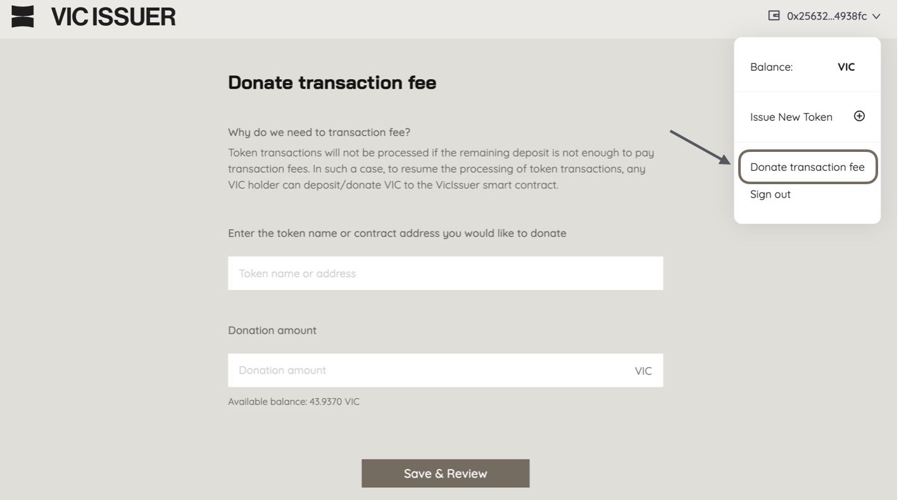

# How to verify a contract on Vicscan

**Outcome:**&#x20;

* Verifying a smart contract on Viction is a crucial process that ensures transparency and builds trust in blockchain applications
* The contract will be verified with the status “**Contract Verified**”  on [Vicscan](https://www.vicscan.xyz/). Allowing **the source code to be publicly visible to view, read on VicScan**.
* If both the contract is verified and the [project is confirmed](how-to-confirm-a-project-on-vicscan.md), the contract status will be updated to 

**How to verify your contract:**

* **Approach 1**: Manual Contract Verification [Vicscan](https://www.vicscan.xyz/)
  * **Action Required**: Partners manually verify the contract on [Vicscan](https://www.vicscan.xyz/).
  * **Steps**:
    * Go to the VicScan explorer and search for the contract.
    * Click on **Contract/Verify & Publish** to initiate the verification process.

<figure><figcaption></figcaption></figure>

* **Approach 2**:
  * **Action Required**: Alternatively, partners can use the Hardhat plugin to verify the contract. A detailed guide is available to assist with this process.
  * **Guidance**: [Hardhat | Viction](https://docs.viction.xyz/smart-contract-development/smart-contract-verification/hardhat).
