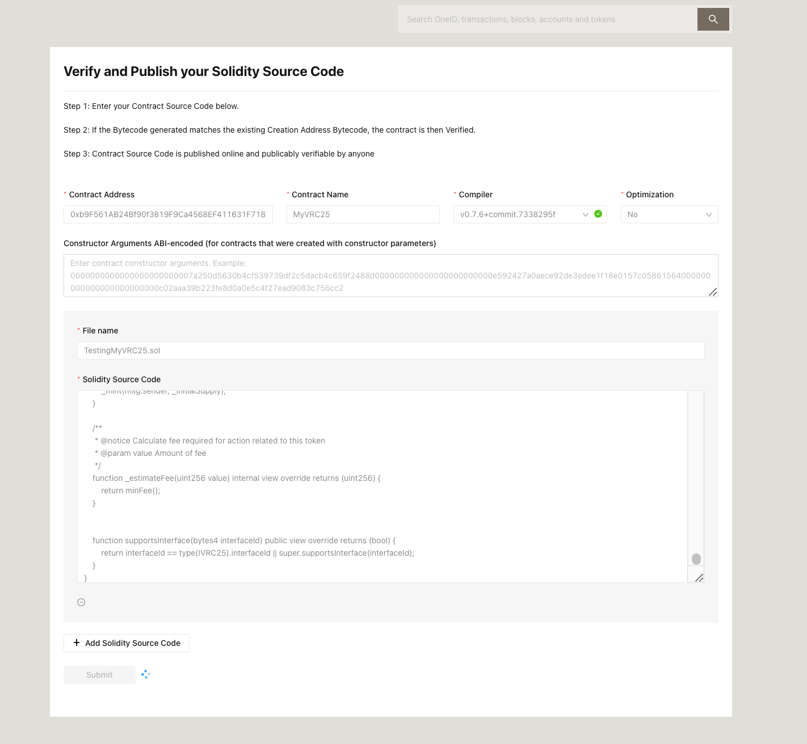
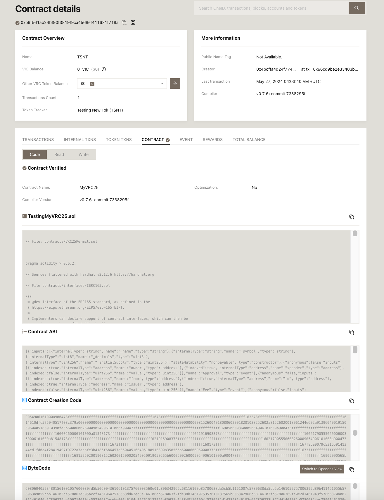

# How to verify if a contract has been issued via VICIssuer

## Prerequisites

A token cantract is issued by VICIssuer (Guide: [https://docs.viction.xyz/how-to/how-to-issue-a-token-via-vicissuer](https://docs.viction.xyz/how-to/how-to-issue-a-token-via-vicissuer))

* VICIssuer on Testnet: [https://issuer-testnet.viction.xyz/](https://issuer-testnet.viction.xyz/)
* VICIssuer on Mainnet:[https://issuer.viction.xyz/](https://issuer.viction.xyz/)

## Verify the token contract

Open the contract detail URL on the **Vicscan** or **VICIssuer** UI

<figure><figcaption></figcaption></figure> <figure><figcaption></figcaption></figure>

Click on the **Contract** tab & click on **Verify & Publish** button

<figure><figcaption></figcaption></figure>

Fulfill the details for:

* **Contract Address**: **Fetched** the contract address **automatically**
* **Contract Name**: If you create a **token** via **Viction Issuer** then the name should be
  * **MyVRC25Mintable** for **Reissueable** token (selected when issuing)
  * **MyVRC25** for **Non-reissueable** token
* **Complier:** Select the compiler version **v0.7.6** for verifying the **contract is issued** from **VicIssuer**
* **Optimization:** Default is **No**. Refer: ['Runs (Optimizer) ' and 'Optimization' while verifying source code on Etherscan](https://ethereum.stackexchange.com/questions/64172/runs-optimizer-and-optimization-while-verifying-source-code-on-etherscan)
* Click on the “**Add Solidity Source Code**“ to input the source code.
  * **File name** can be any thing without **space** or **special characters**.
  * **Solidity Source Code**: copy & paste your source code from the VicIssuer screen. If you forget about it, Please view the token info to get it again.

<figure><figcaption></figcaption></figure>

The Contract is verified successfully

<figure><figcaption></figcaption></figure>

