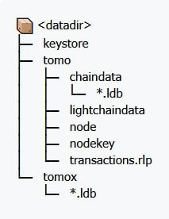

# Troubleshooting

### The node has been running for a long time and couldn't connect to any peer.

#### P2P port is not opened

The common cause for this issue is usually related local machine network configuration, in particular the P2P port (default 30303) is not accessible from the internet. To check that P2P is accessible from outsite, you can use any **open port checker** to help with this. At the time of this writing, a working tool can be used is [https://www.yougetsignal.com/tools/open-ports/](https://www.yougetsignal.com/tools/open-ports/).


Please note that the node must be running while checking for open port.


If the port is not accessible from outsite, please verify local machine firewall and Cloud provider firewall if any.

#### NAT param is not provided

Another common cause for the issue is NAT is not provider via command line when starting the node. Somtimes the node itself cannot determine its external IPv4 address, there when it broadcast its enode to boot node, other peers don't know which IP to connect to.

For instance, the IP of VM running the node is **35.212.224.171**, the NAT param should be:

```
--nat extip:35.212.224.173
```

#### P2P port running on Docker is different from 30303

Official Viction Docker image prior to v2.4.5 doesn't support custom P2P port out of the box. If you're in this case, please use port 30303 only.

Since Viction v2.4.5, the Docker image have a new environment variable `P2P_PORT` to change the P2P for node run inside Docker image.

In Docker setup, EXTIP environment variable is strongly recommended to be provided to support NAT configuration for the node.


In both cases, please map the P2P port of Docker image to same port in the host.

For instance, if you want to have P2P port to 20202, it must be mapped to port 20202 of the host. The command line argument for this example will be

docker run -e EXTIP=35.212.224.171 -e P2P\_PORT=20202 -p 20202:20202 ...


For instance, the IP of VM running the node is **35.212.224.171**, and you want P2P port to be **20202**, the Docker command to start the container should have the following params:

```
-e EXTIP=35.212.224.171 -e P2P_PORT=20202 -p 20202:20202
```

### How to verify if I extract the snapshot correctly.

A common datadir will look like this.

* keystore: where the account for masternode is stored.
* tomo/chaindata: `CHAIN_DATA.tar.zst` will be extracted to this directory.
* tomox: `TOMOX_DATA.tar.zst` will be extracted to this directory.

<figure><figcaption></figcaption></figure>

As of December 2024, the size of datadir is follow, so the extract should be like this or higher:

* Full node: 900 GB
* Archive node: 3743 GB
