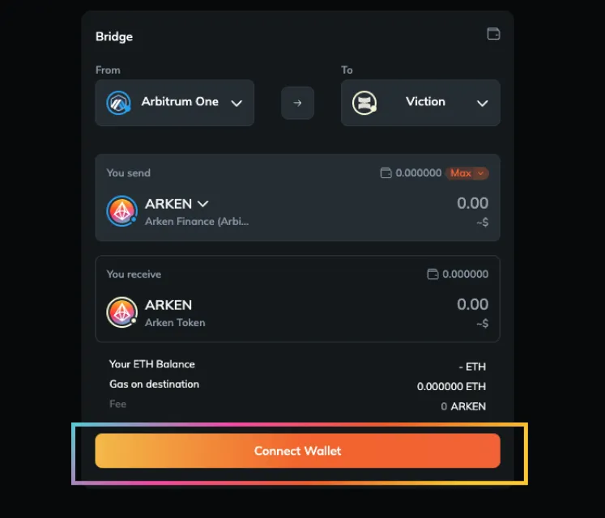

# Arken Bridge

## How to bridge **with Arken Finance?**

Arken Bridge offers a seamless experience for transferring assets between Viction, Binance Smart Chain (BSC), and Arbitrum. Here's a quick overview:

**Step 1:** Head over to [Arken Bridge](https://app.arken.finance/bridge)

<figure><figcaption></figcaption></figure>

**Step 2:** Connect Your Wallet

<figure><figcaption></figcaption></figure>

Click on the **Connect Wallet** button and choose your preferred wallet provider from the available options. Follow the on-screen instructions to establish the connection using WalletConnect.

**Step 3:** Choose Networks

* From: Select the network you're transferring from (e.g., Ethereum if your tokens are there).
* To: Choose "Viction" as the destination network.

<figure><figcaption></figcaption></figure>

**Step 4:** Select Your Token

* In the "Token" section, select the specific token you want to bridge to Viction&#x20;

**Step 5:** Enter Transfer Amount

* Enter the amount of the chosen token you want to transfer to Viction.

**Step 6:** Initiate the Bridge Transaction

* Review the transaction details carefully, including the estimated bridging fees and the time for transfer completion.
* Once confirmed, click on the **Transfer** button to initiate the transfer.

<figure><figcaption></figcaption></figure>

**Step 7:** Approve the Transaction in Your Wallet

* A pop-up window will appear in your connected wallet, requesting your approval for the transaction.
* Review the details again, including gas fees on the originating network (e.g., BSC gas fees if applicable), and confirm the transaction.

**Step 8:** Monitor the Bridge Process

* You can track the progress of your bridge transaction on the Arken Bridge interface or through your wallet provider's transaction history.

**Step 9:** Access Your Bridged Tokens on Viction

* After successful completion, your chosen token will be available in your Viction wallet address. You might need to add the token address manually to your wallet if it's not automatically displayed.


[add-custom-token.md](../viction-wallet/user-guide/add-custom-token.md)



Key points:

* Network Fees: You'll encounter gas fees on the originating network (e.g., BSC) for initiating the bridge transaction. There might also be minimal fees on the Viction network upon receiving the tokens.
* Supported Tokens: Arken Bridge supports a wide range of tokens. Double-check their official website for the latest supported tokens list before proceeding.
* Transaction Approval: Always meticulously review the transaction details before approving it in your wallet.

