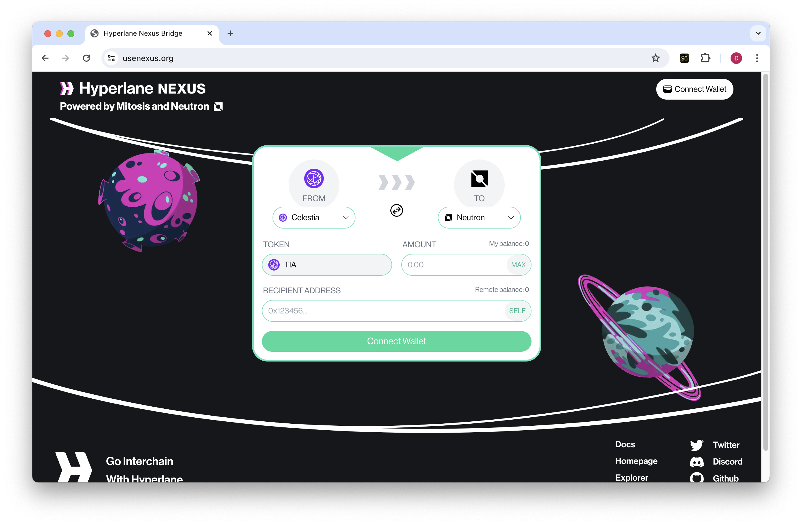
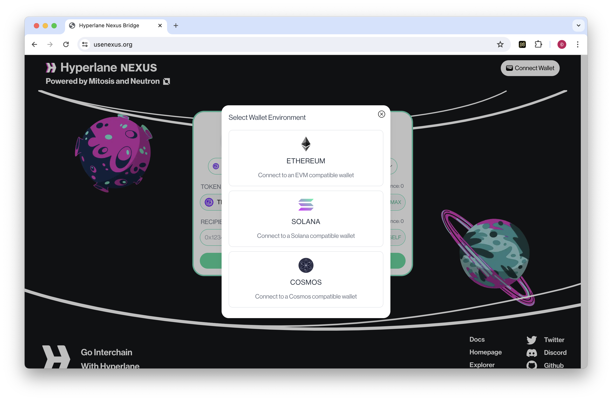
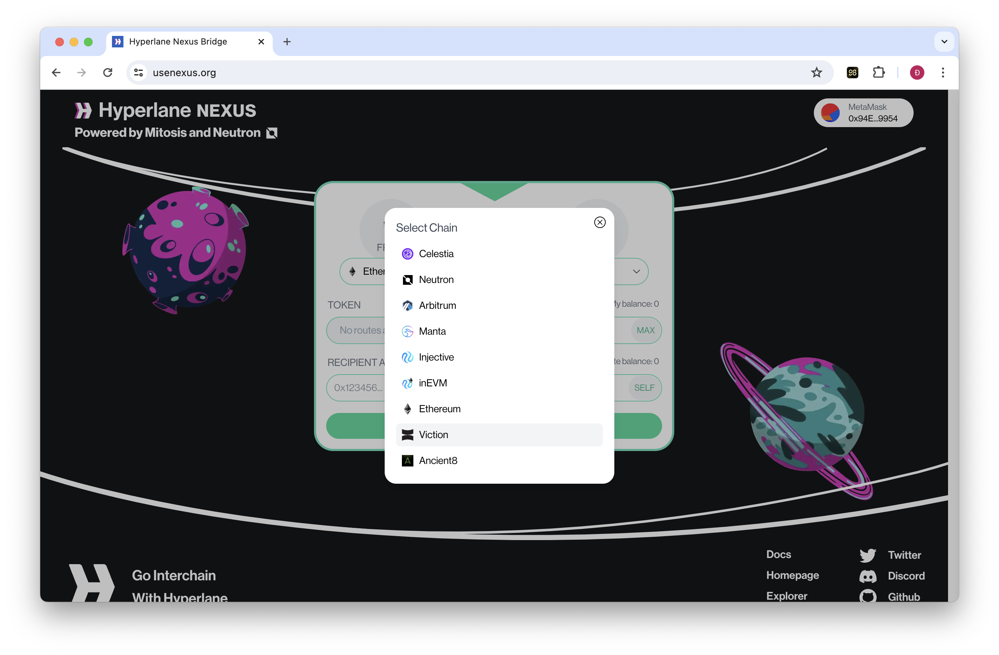
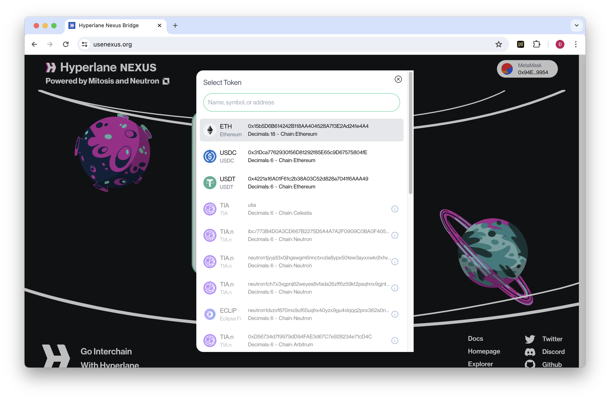
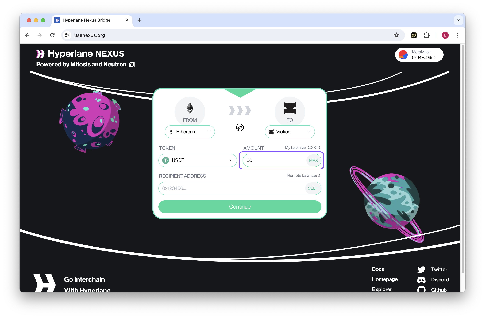

# Hyperlane NEXUS

## **How to Bridge your Assets to Viction using Hyperlane NEXUS**


**Prerequisites:**&#x20;

\- **A crypto wallet** compatible with Ethereum and Viction networks (e.g., MetaMask, WalletConnect).&#x20;

\- **Tokens in your Ethereum wallet** to cover bridging fees and transaction costs on Viction.


**Step 1:** Access [Hyperlane Nexus](https://www.usenexus.org/)
<figure><figcaption></figcaption></figure>

**Step 2:** Connect Your Wallet&#x20;

Click on the **Connect Wallet** button and choose your preferred wallet provider from the available options. Follow the on-screen instructions to complete the connection.
<figure><figcaption></figcaption></figure>

**Step 3:** Select Transfer Options&#x20;

* **Source Chain**: This should be pre-filled as **Ethereum** since you're bridging from the Ethereum mainnet.&#x20;
* **Destination Chain**: Select **Viction** from the dropdown menu.
<figure><figcaption></figcaption></figure>

**Step 4:** Choose Your Token&#x20;

In the **Token** section, choose the specific token you want to bridge to Viction (e.g., ETH, USDC, USDT).
<figure><figcaption></figcaption></figure>

**Step 5:** Enter Transfer Amount&#x20;
Enter the amount of the chosen token you want to transfer to Viction.
<figure><figcaption></figcaption></figure>

**Step 6:** Initiate the Bridge Transaction&#x20;

* Review the transaction details carefully, including the bridging fees and estimated transfer time.&#x20;
* Once confirmed, click on the **Bridge** button to initiate the transfer.

**Step 7:** Approve the Transaction in Your Wallet&#x20;

* A pop-up window will appear in your connected wallet, requesting your approval for the transaction.&#x20;
* Review the details again, including gas fees on the Ethereum network, and confirm the transaction.

**Step 8:** Monitor the Transfer Process&#x20;

You can monitor the progress of your bridge transaction on the Hyperlane Nexus interface or through your wallet provider's transaction history.

**Step 9:** Access Your Bridged Tokens on Viction&#x20;

Once the transaction is complete, your chosen token will be available in your Viction wallet address. You might need to add the token address to your wallet manually if it's not automatically displayed.


**Important Considerations:**

* **Network Fees:** You'll incur gas fees on the Ethereum network for initiating the bridge transaction. Additionally, there might be minimal fees on the Viction network upon receiving the tokens. 
* **Bridge Fees:** Although the gas fee of Viction is relatively small, the bridge fee (charged by Hyperlane) could be significant.
* **Supported Tokens:** Currently, Hyperlane Nexus on Viction supports ETH, USDC, and USDT. Double-check if the token you desire is included before proceeding.
* **Transaction Approval:** Always review the transaction details thoroughly before approving it in your wallet.
* **Token Utilities:** The utility of bridged tokens (ETH, USDT, USDC,...) are still under development, ensure you have researched and a clear usage purpose of the bridged tokens in mind before doing bridge.


By following these steps, you can leverage Hyperlane Nexus to seamlessly bridge your assets from Ethereum to the Viction blockchain and explore the exciting opportunities it offers.
