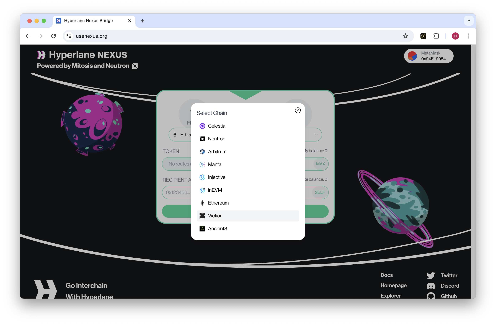
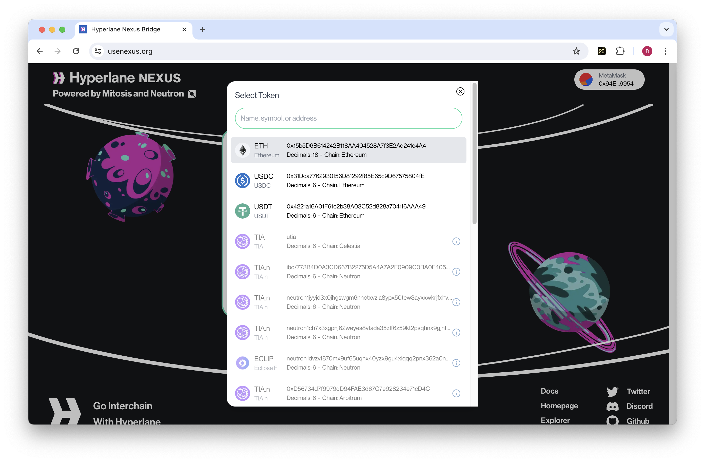

# Hyperlane

## **Hướng dẫn Chuyển đổi Tài sản của bạn sang Viction bằng Hyperlane NEXUS**


**Điều kiện tiên quyết:**

\- **Ví tiền điện tử** tương thích với mạng lưới Ethereum và Viction (ví dụ: MetaMask, WalletConnect).

\- **Token trong ví Ethereum của bạn** để trả phí chuyển đổi và chi phí giao dịch trên Viction.


**Bước 1:** Truy cập [Hyperlane Nexus](https://www.usenexus.org/)

<figure><figcaption></figcaption></figure>

**Bước 2:** Kết nối ví của bạn

Nhấp vào nút **Kết nối Ví (Connect Wallet)** và chọn nhà cung cấp ví ưa thích từ các tùy chọn có sẵn. Làm theo hướng dẫn trên màn hình để hoàn tất kết nối.

<figure><figcaption></figcaption></figure>

**Bước 3:** Chọn Tùy chọn Chuyển

* **Chain Nguồn (Source Chain)**: Chuỗi này phải được điền sẵn dưới dạng **Ethereum** vì bạn đang kết nối với Ethereum mainnet.
* **Chain đích (Destination Chain0**: Chọn Viction từ menu tuỳ chọn

<figure><figcaption></figcaption></figure>

**Bước 4:** Chọn Token muốn chuyển

Trong phần **Token**, hãy chọn token cụ thể bạn muốn kết nối với Viction (ví dụ: ETH, USDC, USDT).

<figure><figcaption></figcaption></figure>

**Bước 5:** Nhập số tiền chuyển

Nhập số lượng token đã chọn mà bạn muốn chuyển sang Viction.

<figure><figcaption></figcaption></figure>

**Bước 6:** Bắt đầu Giao dịch Chuyển đổi

* Kiểm tra chi tiết giao dịch cẩn thận, bao gồm phí chuyển đổi và thời gian chuyển khoản ước tính.
* Xác nhận xong, nhấp vào nút Chuyển đổi (**Brigde**) để bắt đầu chuyển tiền.

**Bước 7:** Phê duyệt Giao dịch trong Ví của bạn

* Ví được kết nối của bạn sẽ xuất hiện một cửa sổ bật lên, yêu cầu bạn phê duyệt giao dịch.
* Kiểm tra lại chi tiết, bao gồm phí gas trên mạng lưới Ethereum, và xác nhận giao dịch.

**Bước 8:** Theo dõi Quá trình Chuyển đổi

Bạn có thể theo dõi tiến trình của giao dịch chuyển đổi trên giao diện Hyperlane Nexus hoặc thông qua lịch sử giao dịch của nhà cung cấp ví.

**Bước 9:** Truy cập Token đã Chuyển đổi trên Viction

Sau khi giao dịch hoàn thành, token đã chọn của bạn sẽ có sẵn trong địa chỉ ví Viction của bạn. Bạn có thể cần thêm thủ công địa chỉ token vào ví của mình nếu nó không được hiển thị tự động.


**Những lưu ý quan trọng:**

* **Phí Mạng (Network Fees)**: Bạn sẽ phải trả phí gas trên mạng lưới Ethereum để khởi tạo giao dịch chuyển đổi. Ngoài ra, có thể có một khoản phí tối thiểu trên mạng lưới Viction khi nhận token.
* **Phí Chuyển đổi Bridge Fees)**: Mặc dù phí gas của Viction tương đối nhỏ, phí chuyển đổi (do Hyperlane tính) có thể đáng kể.
* **Token được Hỗ trợ (Supported Tokens)**: Hiện tại, Hyperlane Nexus trên Viction hỗ trợ ETH, USDC và USDT. Kiểm tra kỹ xem token bạn mong muốn có được bao gồm trước khi tiến hành.
* **Phê duyệt Giao dịch (Transaction Approval)**: Luôn luôn xem xét kỹ lưỡng các chi tiết giao dịch trước khi phê duyệt trong ví của bạn.
* **Tiện ích của Token (Token Utilities)**: Tính năng sử dụng của token chuyển đổi (ETH, USDT, USDC,...) vẫn đang được phát triển, hãy đảm bảo bạn đã nghiên cứu và sử dụng với mục đích rõ ràng cho các token chuyển đổi này trước khi thực hiện chuyển đổi.


Bằng cách thực hiện theo các bước này, bạn có thể tận dụng Hyperlane Nexus để chuyển tài sản của mình một cách liền mạch từ Ethereum sang Viction blockchain và khám phá những cơ hội thú vị nó mang lại.
